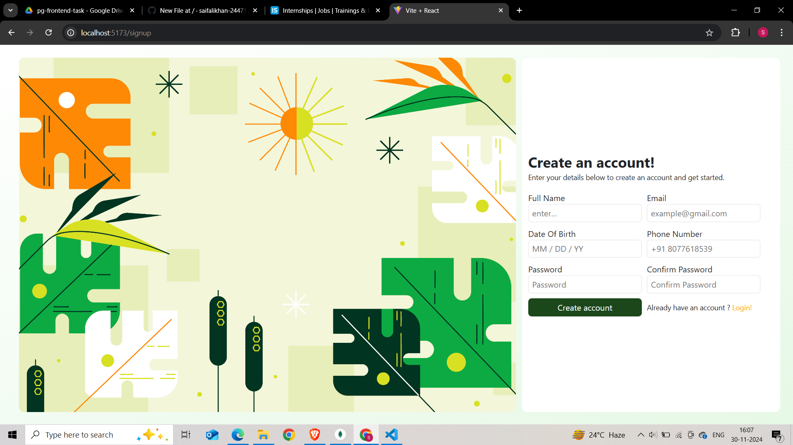
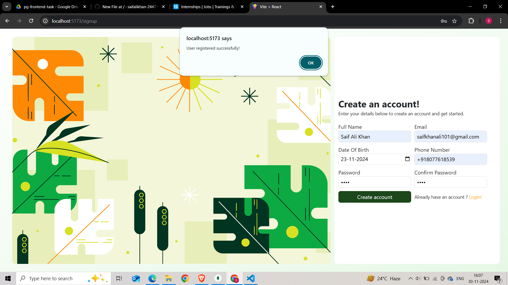
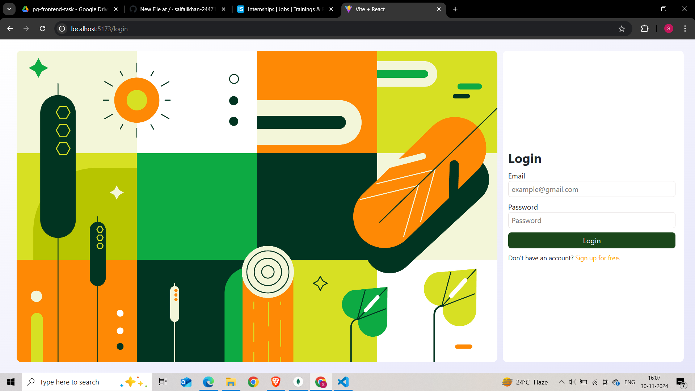
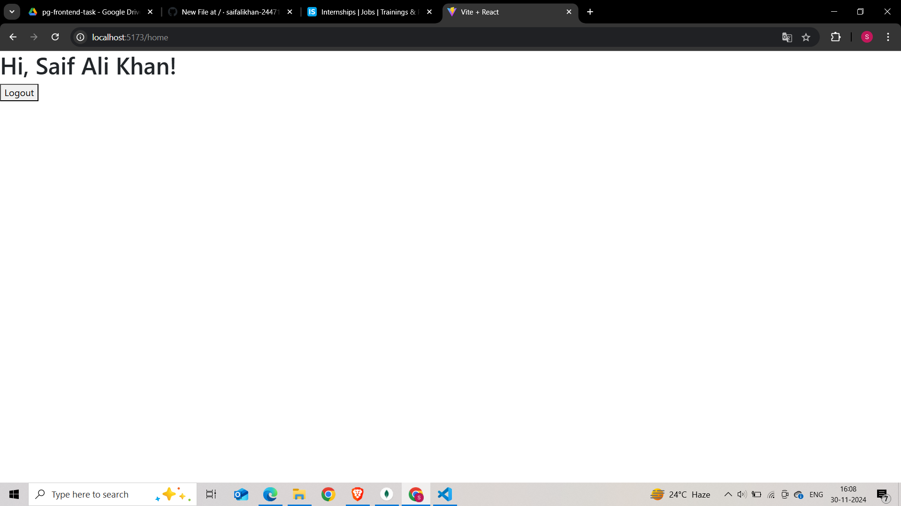

# User Registration Form

MERN stack user authentication system with VITE. It allows users to securely sign up and log in with JWT Tokens for authentication and bcrypt for password hashing/encryption. The frontend is developed with React and Axios, while the backend is powered by Node.js, Express, and MongoDB

## Tech Stack
- **Frontend**: React, Axios, Vite
- **Backend**: Node.js, Express, MongoDB
- **Styling**: CSS (custom styles)

### Prerequisites
1. **MongoDB**: Make sure MongoDB is installed and running locally or use MongoDB Atlas for cloud based Database.
2. **Node.js**: Ensure that Node.js is installed on your desktop.

### Installation:
1. **Backend**: 
   - Navigate to the server directory and run `npm install` to install dependencies.
   - Set up your MongoDB connection by adding the Mongo URI (MONGODB_URI=your_mongodb_connection_string) to the `.env` file and also add your JWT secret key (JWT_SECRET=your_jwt_secret_key).
   - npw navigate to your server directory and run nodemon /server.js.

2. **Frontend**: 
   - Navigate to the client folder and run `npm install` to install frontend dependencies.
   - Run the frontend server with `npm run dev`, and click the link in terminal with ctrl and finally you will be able to use it

### Authentication Flow Screenshots for Demo
1. **Signup Page**: 

3. **Signup Success**: 

5. **Login Page**:

7. **After Logging Home Page**:

